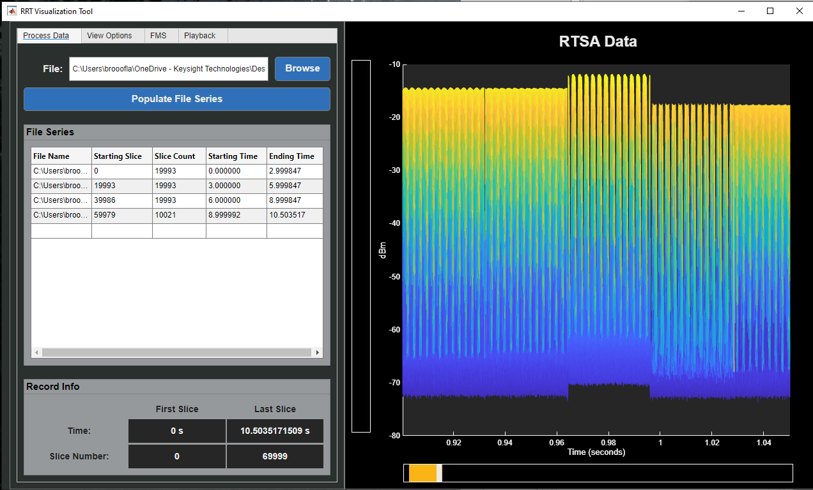
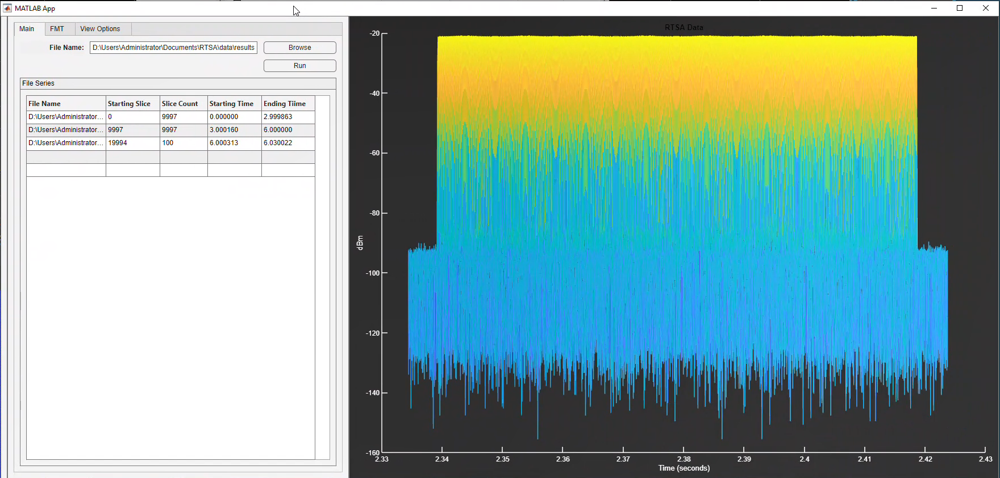
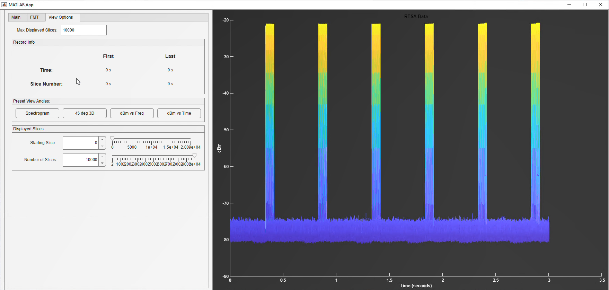
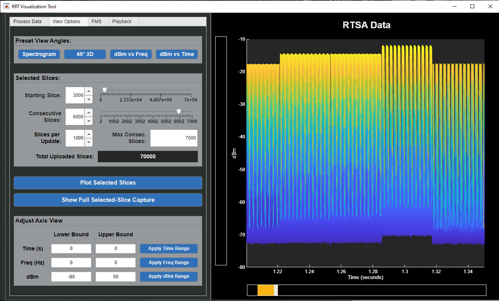
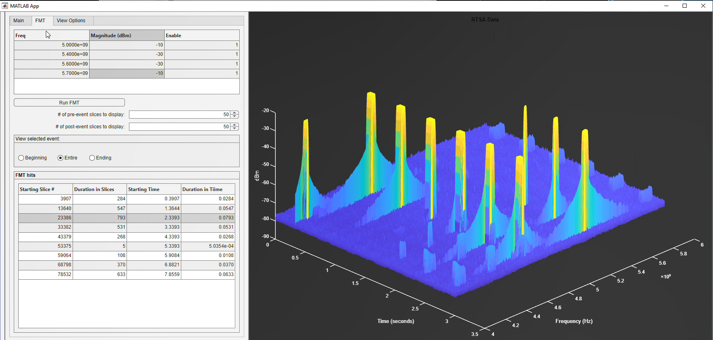
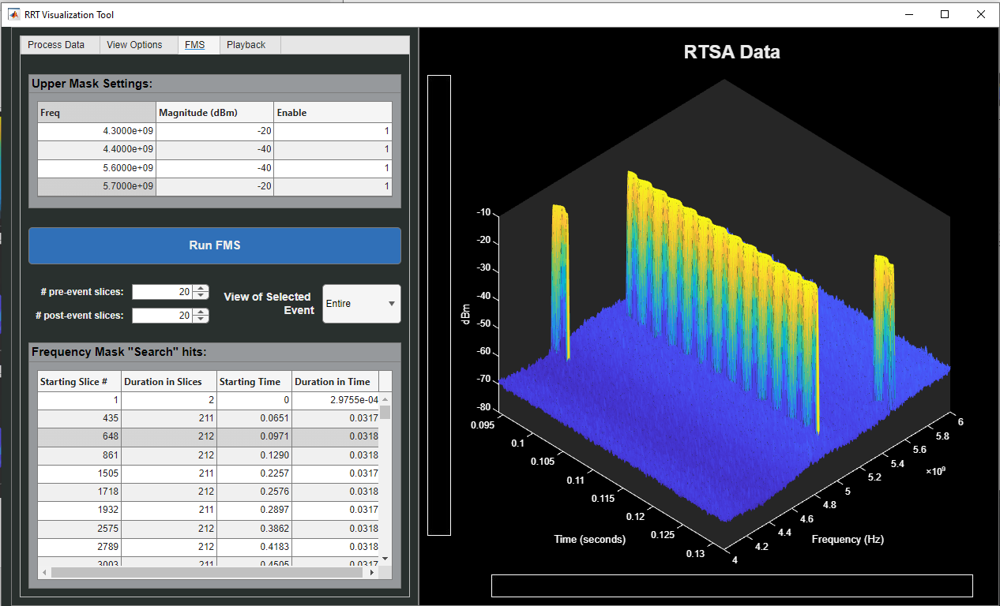
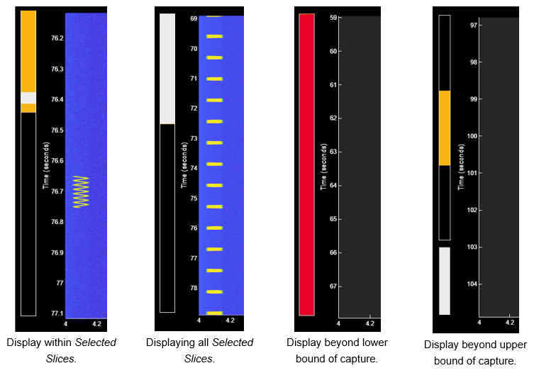
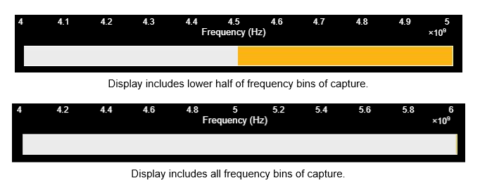
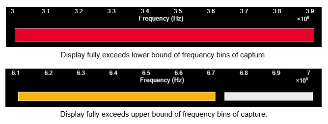

# RRT Example Application

## What is RRT?

RRT is an addable option to Keysight's N9032B and N9042 X-Series Analyzers that streamlines IQ data acquisition by disabling the instrument's display. The resulting data is output to binary files, meant to be decoded and processed by the user. The RRT Data Viewer is an example application that uses MATLAB to decode the binary files output by Option RRT and provides visualization and analytical tools for post-processing of the decoded data.

## What did I do?

RRT Applciation Note: [Real Time Spectrogram Streaming (Option RRT)](https://www.keysight.com/us/en/assets/3124-1730/application-notes/Real-Time-Spectrogram-Streaming.pdf)

This application was started by a seperate engineer within Keysight and fell through the cracks of development. While working on documentation surrounding the new option RRT, I was exposed to the initial barebones of this application and jumped at the opportunity to innovate upon it to improve customer experience. My implemented innovations included user feedback through process bars, error messages, and other appropriate pop-ups; intelligent groupings of features and weight design of interactables to help users know which buttons they should need to press upon boot without consulting a manual; and an aesthetic overhall so the application matched

## Demonstrational Video

As part of documenting the new feature, I made a video that highlights how to navigate/use the example RRT application. Below image links to video on Vimeo.

***

## GUI Changes

Below are examples of the GUI before and after I changed the formatting. Visual representations do not show all implemented bug fixes from user testing.

 

### Process Data Tab

The 'main' tab of the example application is the first users see upon launching the application. For the rest of the application to function, users must upload their capture data on this page. To help guide users, I made the biggest buttons on this page "Browse" — the button through which users find the first file of their capture they wish to upload — and "Populate File Series" — which actually begins the upload and decoding of data.

| Original Layout | Modified Layout |
| ----------------------------------------------------------- | ------------------------------------------------------------------------------ |
|  |  |
| *Fig 1. Main tab before edits* | *Fig 2. Main tab, renamed 'Process Data' tab, after edits.* |

 

### View Options Tab

The 'View Options' tab underwent the greatest design overhaul, gaining more viewing features as I worked with the engineers behind the instrument's new capture feature.

| Original Layout | Modified Layout |
| ----------------------------------------------------------- | ------------------------------------------------------------------------------ |
|  |  |
| *Fig 3. 'View Options' tab before edits* | *Fig 4. 'View Options' tab after edits* |

 

### Frequency Mask Trigger/Search Tab

| Original Layout | Modified Layout |
| ----------------------------------------------------------- | ------------------------------------------------------------------------------ |
|  |  |
| *Fig 5. 'Frequency Mask Trigger' (FMT) tab before edits* | *Fig 6. 'FMT' tab, renamed 'Frequency Mask Search' (FMS) as the feature is post-processing after edits* |

 

### Added Tab: Playback

The process of rendering a lot of data through MATLAB introduces a great deal of latency. To help combat this and provide the user the ability to view renderings of large portions of their data, I added a 'Playback' tab that discards a render the moment new data reaches the screen.

### Additional Changes: Reference Bars

In a capture of thousands of slices, it is easy to get lost in one's own data. During development of the example application, the idea came up — what if, similar to the Apple's viewing bar for videos, we implemented reference bars that orient a user as to where in the time and frequency range of their data capture they were viewing?

When beside the time axis, the reference bar’s length represents the duration of the processed capture, the yellow portion the duration of selected (rendered) slices, and the white portion the duration of currently displayed slices. When past the time duration of the capture, the white bar representing display will continue, showing how far removed from the capture the user is; when the display lands fully before the time duration of the capture, the reference bar will become red, representing that the lower bound of the capture has been fully crossed.

*Fig 7. Time reference bar: bar length represents capture duration, yellow represents Selected Slices duration, white represents displayed duration.*

When next to the frequency axis, the reference bar’s yellow portion represents the range of frequency bins of the capture, while the white portion the relative amount of frequency bins currently displayed. Once again, if users go beyond the upper bound of the capture’s frequency bins, the white bar representing display will continue to how far out the user’s display is; if the user’s display fully exceeds the lower bound of the capture’s frequency bins, the reference bar will become red.

|   |   |
| ------------------------------------------------------------------------------ | ------------------------------------------------------------------------------ |
|  |  |

*Fig 8. Frequency Reference Bar: yellow/bar represent range of frequency bins of capture, white represents range of frequency bins in display.*
