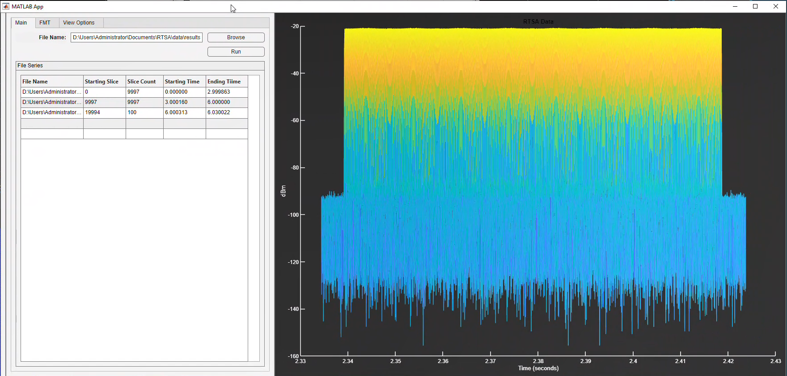
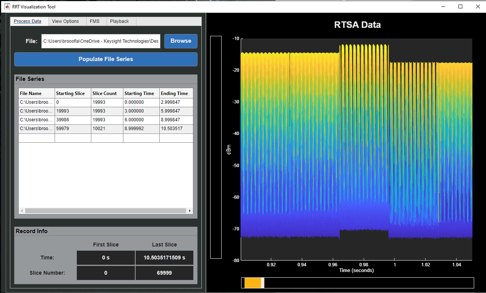
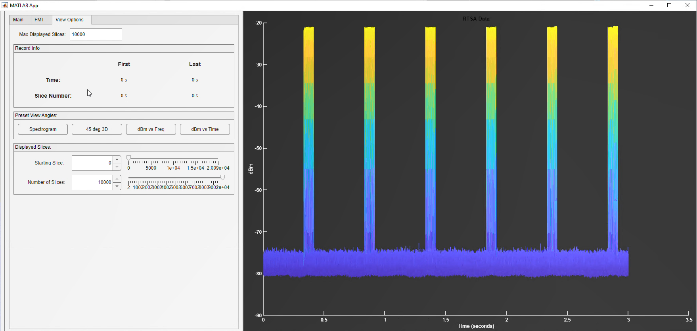
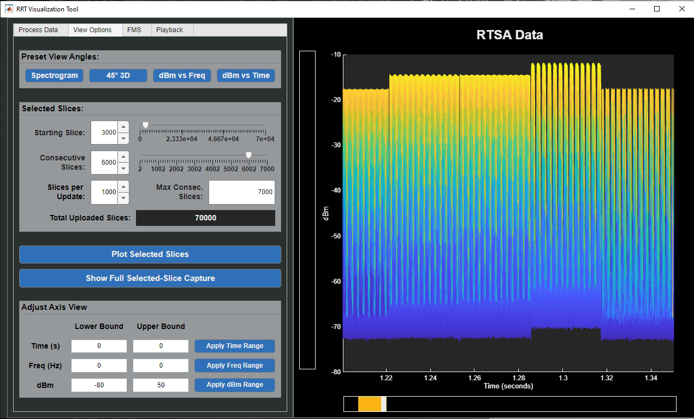
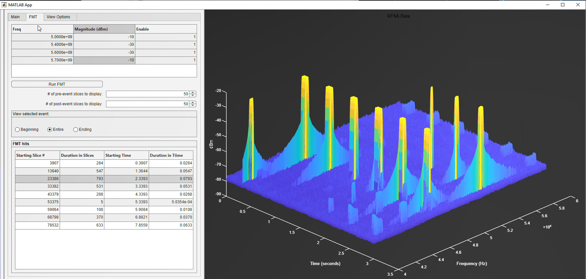
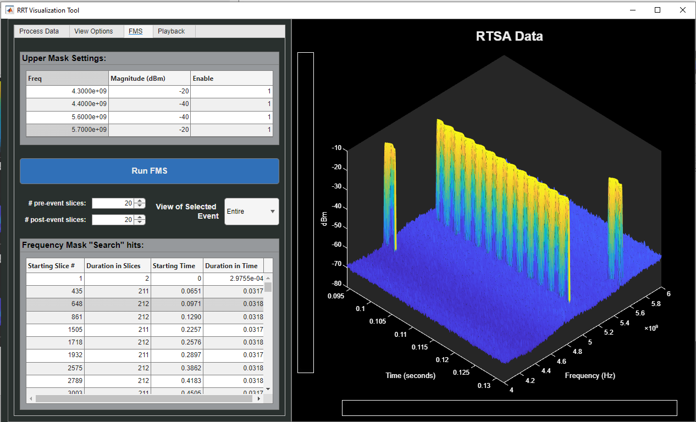

# RRT Example Application

## What is RRT?
RRT is an addable option to Keysight's N9032B and N90402 X-Series Analyzers that streamlines IQ data acquisition by disabling the instrument's display. The resulting data is output to binary files, meant to be decoded and processed by the user. The RRT Data Viewer is an example application that uses MATLAB to decode the binary files output by Option RRT and provides visualization and analytical tools for post-processing of the decoded data.

## What did I do?
This application was started by a seperate engineer within Keysight and fell through the cracks of development. While working on documentation surrounding the new option RRT, I was exposed to the initial barebones of this application and jumped at the opportunity to innovate upon it to improve customer experience. My implemented innovations included user feedback through process bars, error messages, and other appropriate pop-ups; intelligent groupings of features and weight design of interactables to help users know which buttons they should need to press upon boot without consulting a manual; and an aesthetic overhall so the application matched

***

### GUI Changes
Below are examples of the GUI before and after I changed the formatting. Visual representations do not show all implemented bug fixes and user testing.

**Process Data Tab**

*Fig 1. Main tab before edits*

*Fig 2. Main tab, renamed 'Process Data' tab, after edits.*

**View Options Tab**

*Fig 3. 'View Options' tab before edits*

*Fig 4. 'View Options' tab after edits*

**Frequency Mask Trigger/Search Tab**

*Fig 5. 'Frequency Mask Trigger' (FMT) tab before edits*

*Fig 6. 'FMT' tab, renamed 'Frequency Mask Search' (FMS) as the feature is post-processing after edits*

**Added Tab: Playback**
The process of rendering a lot of data through MATLAB introduces a great deal of latency. To help combat this and provide the user the ability to view renderings of large portions of their data, I added a 'Playback' tab that discards a render the moment new data reaches the screen.
